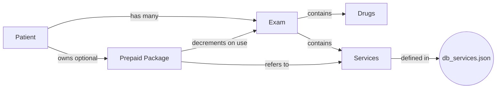

# Version 0.9.260307 (2026-03-07)
==================================================

## Project Analysis & Summary
- Introduced full **Service List** management and patient **pre‑paid package** support.
- Services are now selectable during exam creation/edit, multiple per exam, and their cost contributes to the total.
- Patients may purchase multi‑session packages; the system automatically applies discounts and decrements remaining sessions.

## New Features
- **Service & Department Database**:
  - New encrypted database `db_services.json` (TinyDB) holds service records `{id, department, name, price}`.
  - Added settings submenu to manage departments and services (`Cài đặt → Khoa / Dịch vụ`).
  - CRUD API endpoints `/api/services` with full create/read/update/delete functionality.

- **Exam Workflow Enhancements**:
  - `new_exam` and `edit_exam` pages now include a service selector and table identical to the drug interface.
  - Multiple services may be added/removed; UI updates totals in real‑time.
  - A manual **override total** field lets doctors adjust final cost independent of line items.
  - Backwards compatibility: existing exams without services render as "No service" and remain editable.

- **Pre‑paid Packages**:
  - Patients can have packages stored under their record (`patient.packages`).
  - When applying a service, the system checks for a matching package with remaining sessions; if found, it uses the package unit price and decrements the count.
  - Package management (creation/edit) will be exposed on the patient profile page in an upcoming iteration.

- **PDF/Print Updates**:
  - Generated exam PDFs now include a services section with name and price.
  - Total calculation respects override and package discounts.

## Data Model & Linkage
The following diagram illustrates relationships:

- A **Patient** record stores `exams` and optional `packages`.
- Each **Exam** may list zero or more services, copied from the services database at the time of entry.
- **Packages** are tied to a specific service and track `remaining_sessions` and `unit_price`.
- When an exam uses a service covered by a package, `remaining_sessions` is reduced and the exam cost is adjusted.

## Technical Notes
- Added service handling logic in `routes/exam.py` (see `service_ids`, `services` arrays, and package decrement).
- Template updates in `new_exam.html` and `edit_exam.html` include service selector/table and `calculateTotals()` adjustments.
- `utils/pdf_generator.py` extended to render services section.
- `shared_db.py` now initializes `services_table`.
- Changelog and guide updated accordingly.

# Version 0.8.260228 (2026-02-28)
==================================================

## Project Analysis & Summary
- Added database encryption/decryption management tools for admins.
- Implemented secure decrypt and export functionality with browser downloads.
- Added placeholder for future import functionality.

## New Features
- **Database Management Tools**:
  - **Decrypt & Export**: New admin-only page to decrypt all `.json` database files.
  - **Export Function**: One-click decryption of all databases (`db.json`, `db_mua_thuoc.json`, and any future DB files).
  - **Browser Downloads**: Users can download decrypted files via browser with proper file validation.
  - **Auto-detection**: System automatically detects all `.json` files in root directory for export.
  - **Dynamic File Handling**: Supports current and future database files without code changes.
- **Security & Admin Dashboard**:
  - **Admin Restricted**: All decrypt/export features require admin login.
  - **Decrypted Exports Directory**: Unencrypted files stored in `decrypted_exports/` folder with clear naming.
  - **Security Notice**: UI warns about unencrypted file handling and data sensitivity.
  - **Admin Menu Integration**: New "Database Management" section in Admin Dashboard.
- **Import Placeholder**:
  - **Dedicated Page**: Placeholder for future import functionality.
  - **Planned Features**: Documented future import capabilities (file upload, validation, merge options, backup creation).

## Technical Details
- **Utility Functions** (`utils/storage.py`):
  - `get_encryption_key()`: Retrieve encryption key from environment.
  - `decrypt_file()`: Decrypt single encrypted JSON file.
  - `get_json_database_files()`: Auto-detect all `.json` database files.
  - `export_decrypted_databases()`: Batch decrypt and save all databases.
- **Routes** (`routes/admin.py`):
  - `/admin/database/decrypt`: Display decrypt/export page.
  - `/admin/database/export` (POST): Trigger decryption of all files.
  - `/admin/database/download/<filename>`: Secure file download with validation.
  - `/admin/database/import-page`: Import placeholder page.
  - `/admin/database/import` (POST): Import placeholder endpoint.

# Version 0.7.260902 (2026-02-09)
==================================================

## Project Analysis & Summary
- Major overhaul of image management in Exam Edit mode, including robust upload/delete functionality and image previews.
- Fixed critical data persistence issues where deleted images would reappear.
- Optimized UI layout for better usability.

## New Features
- **Image Management (Edit Exam)**:
  - **Upload Improvements**: Added ability to upload multiple images with auto-resize (max 1MB).
  - **Previews**: Added immediate image thumbnails upon file selection.
  - **Gallery**: Display of existing images with "Click to enlarge" and "Delete" actions.
  - **Modal**: integrated full-size image viewer and compare
- **UI Refinements**:
  - **Service Type Layout**: Moved "Loại khám" radio buttons to a new line for better visibility.
  - **Path Normalization**: Fixed broken image links on Windows by normalizing file paths.

## Fix
- **Data Persistence**:
  - Fixed a race condition where the "Delete Image" button triggered a form submission, causing deleted images to be resurrected in the database.
  - Refactored backend logic (`upload_images`, `delete_exam_image`) to explicitly update list indices for reliability.
- **Bug Fixes**:
  - Fixed `lab_images` field name mismatch preventing uploads.
  - Fixed 404 errors for deleted images.

# Version 0.6.260206 (2026-02-06)
==================================================

## Project Analysis & Summary
- Refined department ("Phòng Khám") management with cascading updates and better admin tools.
- Enhanced traceability by assigning legacy exams to specific users ("BS. TTKH") and displaying creator tags across the UI.
- Improved the "Danh sách toa thuốc" interface for better readability.

## New Features
- **Refined PK Management**:
  - **Settings**: Renamed "Khoa / Loại khám" to "Danh sách Phòng Khám (PK)".
  - **Cascading Updates**: Removing a PK automatically resets assigned users to "Chưa có PK".
  - **Admin Dashboard**: Added PK selection dropdowns for "Add User" and a new "Edit User" modal.
- **Creator Assignment & Tags**:
  - **Migration**: Assigned all legacy exams to user 'hue' (displayed as "**BS. TTKH**").
  - **UI Tags**: Added tags for Department (e.g., "PK Nhi") and Creator (e.g., "BS. TTKH") to:
    - **Exam History** (`/patient/<id>/exams`)
    - **Exam List** (`/danh_sach_kham_benh`): Tags moved to a new line below patient info for clarity.
    - **Edit Exam**: Displayed "Bác sĩ khám" info.

## UI Improvements
- **Exam List (`/danh_sach_kham_benh`)**:
  - Moved tags (Department/Creator) to a dedicated line for better layout.
  - Used distinct colors (`is-warning` for Department, `is-info` for Creator) to distinguish metadata.

## UI & UX Enhancements
- **Exam List (`/danh_sach_kham_benh`)**:
  - Resized "Hành động" column to ensure better button alignment.
  - Action buttons (Edit and Payment Status) are now displayed side-by-side on desktop with improved responsive spacing for mobile.
- **Drug Sold Report (`/drug_sold`)**:
  - Added an informative notification box explaining the "Suggested Stock" (Nên trữ) calculation logic in Vietnamese.
  - Introduced price trend indicators (↑/↓) in the purchase history table to visualize price per unit (PPU) changes between consecutive restocks.

# Version 0.6.260128 (2026-01-28)
==================================================

## Project Analysis & Summary
- Fixed critical database access issues in the refactored drug management routes.
- Ensured proper use of encrypted storage layer for sensitive purchase data.

## Fix
- **Drug Management Routes**:
  - Fixed `UnicodeDecodeError` in `/drugs` endpoint caused by attempting to read encrypted `db_mua_thuoc.json` without proper decryption.
  - Updated `routes/drugs.py` to use `EncryptedJSONStorage` for all `db_mua_thuoc.json` access in both `manage_drugs()` and `edit_drug()` functions.
  - Ensured consistency with existing encrypted storage implementation in `routes/mua_thuoc.py`.

# Version 0.5.260126 (2026-01-26)
==================================================

## Project Analysis & Summary
- Implemented a comprehensive security overhaul including database encryption and session-based authentication.
- Centralized user management with a new Admin Dashboard.
- Hardened the application infrastructure by securing logs and environment configurations.

## New Features
- **Security System**:
  - **AES-GCM Database Encryption**: Encrypted all TinyDB files at rest to protect patient data.
  - **Authentication System**: Integrated `Flask-Login` for secure user sessions.
  - **Admin Dashboard**: New route (`/admin`) for managing system users, resetting passwords, and controlling access roles.
  - **Environment Configuration**: Moved sensitive keys (Secret Key, Encryption Key) to a `.env` file (Git ignored).
- **Maintenance Tools**:
  - **Restore Utility**: Created `restore_db.py` for safe database recovery from encrypted backups.
  - **Log Redaction**: Automatic masking of passwords and secrets in system logs.

## Fix
- **System Stability**: 
  - Cleaned up `requirements.txt` to resolve dependency conflicts and remove unused libraries (Kivy, Django).
  - Fixed `base_generic.html` template reference in Admin Dashboard.
- **UI**: 
  - Added user identifier and dynamic Login/Logout links to the navigation bar.

# Version 0.4.200121 (2026-01-21)
==================================================

## Project Analysis & Summary
- Overhauled the "/drug_sold" page to provide accurate sales vs. purchase comparisons.
- Added new money flow report (`/money_flow`) that logs real amounts received along with date and user. This report is printable as PDF via browser.
- Introduced Safety Stock analysis to help with inventory planning.
- Fixed file locking issues on Windows by using a shared database instance.
- Polished visuals with a cleaner, dark-mode friendly table design.

## New Features
- **Drug Sold Page Overhaul**:
  - **Union View**: Displays all drugs that were either sold OR purchased in the selected period.
  - **Safety Stock**: New column calculating suggested stock levels based on max/avg daily usage and lead time (3-5 days).
  - **Purchase History**: Improved mini-table layout (Date | Qty | Price) directly within the report row.
  - **Data Clarity**: Explicit "- no data -" markers for missing sales or purchase history.

## Fix
- **System Stability**: 
  - Fixed `TinyDB` concurrency error where `app.py` and `routes/mua_thuoc.py` conflicted over `db_mua_thuoc.json` access.
- **UI**: 
  - Removed white background artifacts in purchase history tags for better dark mode compatibility.
  - Removed unnecessary icons from "Filter" and "Refresh" buttons for a cleaner look.

# Version 0.3.260117 (2026-01-17)

## Project Analysis & Summary
- Integrated Discord notifications directly into the exam workflow.
- Centralized configuration in a new Settings page.
- Polished UI with toast notifications and improved defaults.

## New Features
- **Discord Integration**:
  - Global "Settings" page to configure Webhook URL and content preferences.
  - "Auto-send" checkbox in `New Exam` and `Edit Exam` pages (checked by default).
  - Backend helper to format and send detailed exam reports to Discord (Date, Name, Drugs, Image, etc.).
- **UI Polish**:
  - Added global Toast Notifications for better feedback.
  - "Send to Discord" is now enabled by default.

# Version 0.2.260116 (2026-01-16)

## Project Analysis & Summary
- Refined "Manage Drugs" UI with a modern dark theme and improved layout.
- Debugged and resolved exam data mismatches and ID collisions.
- Standardized database access to prevent UTF-8 encoding errors on Windows.

## New Features
- **Enhanced Drug Screen UI**: 
  - Consolidated "Manage Drugs" title, "Add New Drug" button, and search box into a single, sticky row.
  - Redesigned "Add New Drug" modal with a vertical layout for better readability.
  - Improved contrast for search and input placeholders in dark mode.
  - Added modern styling for drug tables with highlighted prices and hover effects.

## Fix 
- **Exam Management**:
  - Fixed a critical bug in `edit_exam` that caused incorrect record updates due to ID mismatch.
  - Resolved `UnicodeDecodeError` in the exam list view by enforcing UTF-8 encoding across all database handles.
  - Improved `total_money` calculation logic to handle empty or malformed price strings robustly.
  - Fixed duplicate/missing exam IDs in the database for existing records.
- **System Stability**:
  - Implemented `shared_db.py` to centralize TinyDB initialization and prevent file handle conflicts.
- **Other**:
  - Fix "Print" vs "PDF" content mismatch in Exam page.
